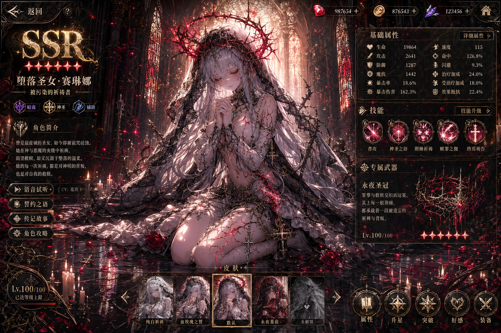
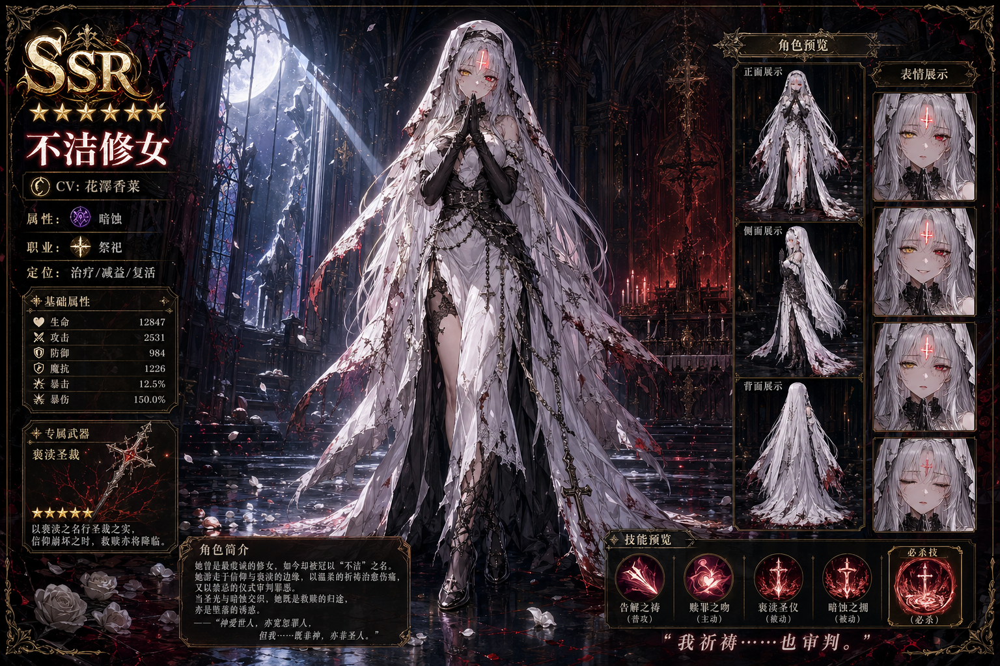
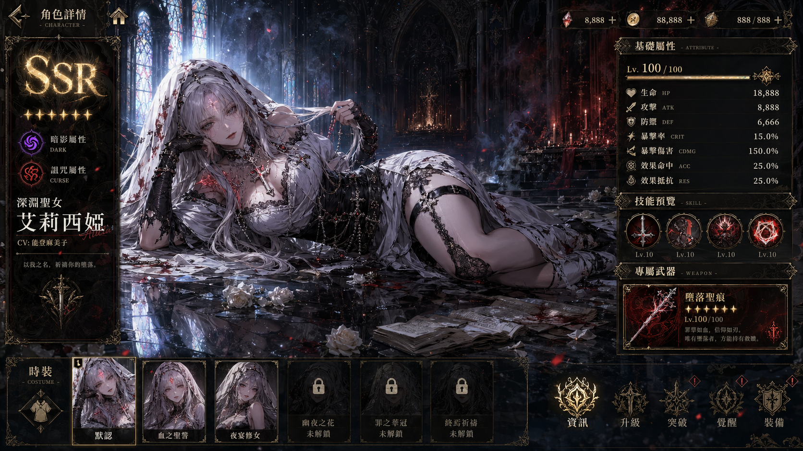
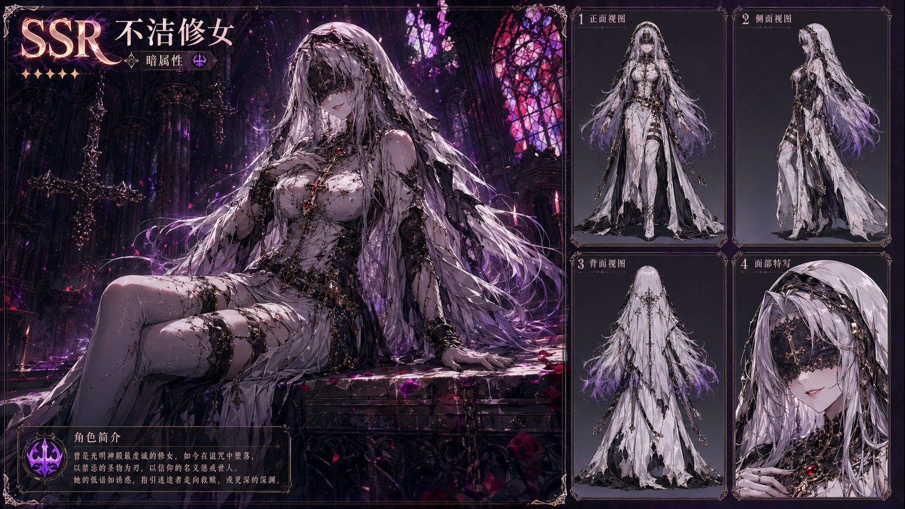

# 二游AI绘画提示词生成器

> **专为 ChatGPT Image2（GPT-4o with image generation）优化设计的二次元手游角色AI绘画提示词生成系统。**
> 
> 将简短的角色描述转化为可直接用于 ChatGPT Image2 的高质量正反提示词，同时兼容 Midjourney / Stable Diffusion。

<p align="center">
  
</p>

---

## 效果预览

<p align="center">
  
  
</p>

<p align="center">
  
  
</p>

## 这是什么？

一个专门为**二次元手游角色AI绘画**设计的提示词生成系统，针对 **ChatGPT Image2** 的中英文混合生图特性深度优化。

**为什么专门优化 ChatGPT Image2？**
- Image2 对**中文叙事描述**理解极好，但对**英文姿势tag**容易产生歧义
- Image2 对**完整UI界面描述**的还原度远高于 MJ/SD
- Image2 对**连贯自然语言段落**的遵循度高于离散tag堆砌

**核心设计理念**：
- **英文tag锚定画风**：`dark fantasy, gothic fantasy, absurdres, cinematic lighting` 直接命中高质量训练集
- **中文叙事控制姿势**：用连贯的空间描述替代离散英文tag，避免Image2姿势崩坏
- **4色锚定**：`black, crimson red, gold, ivory white` 固定色彩基调
- **完整UI界面**：直接生成可玩的抽卡/图鉴/立绘界面，AI自由生成精美装饰性中文文字

---

## 项目结构

```
暗黑幻想画境生成器/
├── SKILL.md                           ← Skill核心（211行），所有Agent通用入口
├── references/                        ← 按需加载的参考文档
│   ├── poses.md                       ← 姿势库完整参考（66个姿势 + 18模板 + 防崩指南）
│   ├── color-system.md                ← 配色体系 + 6维度风格控制
│   └── ui-specs.md                    ← UI类型规范 + 防崩指南
├── examples/                          ← 实际生成示例
│   ├── 不洁修女.md                     ← 标准Skill格式示例
│   ├── 不洁修女_V3.5_修复版.md        ← 侧躺回眸姿势修复示例
│   ├── 不洁修女_提示词_v3.4.md        ← v3.4九区块格式示例
│   └── 恶堕修女_三UI类型提示词.md     ← 抽卡/图鉴/立绘三UI对比示例
├── assets/                            ← README 预览图片
│   ├── character-profile-ui.png
│   ├── character-preview-ui.png
│   ├── side-pose-profile-ui.png
│   └── character-reference-sheet.png
├── archive/                           ← 历史版本
│   ├── 系统提示词_打包版_v3.3.md
│   ├── 系统提示词_打包版_v3.4.md
│   ├── 系统提示词_打包版_v3.5.md
│   └── 系统提示词_打包版_v3.5.1.md
├── package.json                       ← NPM 包配置
├── .gitignore                         ← Git 忽略文件
├── CHANGELOG.md                       ← 版本历史
├── CONTRIBUTING.md                    ← 贡献指南
├── LICENSE                            ← MIT 开源协议
└── README.md                          ← 项目说明
```

---

## 安装方式

### 方式一：NPM 一键安装（推荐）

使用 `npx skills` 命令一键安装到多个 AI Agent：

```bash
npx skills add https://github.com/hellanglla/anime-gacha-prompt-skill
```

安装器会自动检测你的系统中已安装的 AI Agent（Claude Code、Codex、Cursor 等），并让你选择安装到哪些 Agent。

### 方式二：手动安装

本项目设计为**跨平台 Skill**，可安装到任何支持 `SKILL.md` 的 AI Agent 中。

#### Claude Code
```bash
git clone https://github.com/hellanglla/anime-gacha-prompt-skill.git \
  ~/.claude/skills/暗黑幻想画境生成器
```

#### Codex
```bash
# 用户级（全局可用）
git clone https://github.com/hellanglla/anime-gacha-prompt-skill.git \
  ~/.codex/skills/暗黑幻想画境生成器

# 项目级（仅当前仓库）
git clone https://github.com/hellanglla/anime-gacha-prompt-skill.git \
  .codex/skills/暗黑幻想画境生成器
```

#### Cursor
```bash
git clone https://github.com/hellanglla/anime-gacha-prompt-skill.git \
  ~/.cursor/skills/暗黑幻想画境生成器
```

#### OpenCode / 其他 Agent
将 `SKILL.md` + `references/` + `examples/` 复制到对应 Agent 的 skill 目录即可。

> **原理**：所有主流 Agent（Claude Code / Codex / Cursor）都在 skill 目录的根层级查找 `SKILL.md` 作为入口。`references/` 下的文档由 SKILL.md 按需路由加载。

---

## 两种使用方式

### 方式一：作为 AI Skill 使用（推荐）

安装后，直接告诉 AI：
> "生成一个恶堕修女的AI绘画提示词"

Skill 自动触发，执行 3 步工作流并输出完整的正反提示词。

### 方式二：作为系统提示词使用（ChatGPT Image2）

**步骤**：
1. 打开 `SKILL.md`，复制完整内容
2. 粘贴到 ChatGPT 的 System Prompt / 自定义指令 中
3. 输入角色描述即可开始

> **注意**：ChatGPT Image2 原生支持中文生图，无需翻译。如需要完整姿势库参考，可额外将 `references/poses.md` 的内容粘贴进去。

---

## 3步工作流

```
步骤1：输入角色描述
    ↓
步骤2：AI智能推导 + 用户确认
    （身份、阵营、气质、服装、姿势、背景、风格预设）
    ↓
步骤3：生成正反提示词
```

支持 **极速模式**（跳过确认，直接生成）和 **多立绘模式**（一次生成3个变体）。

---

## 5段式输出格式（针对 Image2 优化）

### 正面提示词（Positive Prompt）

```
[画风质量tag] + [角色核心描述] + [服装材质细节] + [背景光影氛围] + [UI界面描述]
```

**示例**（不洁修女 · 图鉴UI）：

```
highly detailed anime illustration, dark fantasy, gothic fantasy, 
gacha game character profile screen, central composition, 
16:9 horizontal composition, masterpiece, best quality, absurdres, 
ultra detailed, sharp focus, correct anatomy, no twisted torso.

画面中央偏右是一位不洁修女，她完全侧向躺卧在崩塌的暗黑大教堂地面上，
右肩、右侧腰胯、右腿外侧完全贴地，左腿自然弯曲叠放在右腿前方，
右手肘撑地、手掌托住头部，左手轻抬撩弄一缕银白发丝，
头部轻转向镜头回眸，眼神冰冷魅惑。人物身体比例必须正确，
腰部无过度扭曲，胯部与大腿自然连接，双腿结构正常无变形。

银黑渐变长发如瀑散落，破损圣衣与黑色皮革交织...
intricate lace texture, ornate metal details, rich texture, polished rendering.

崩塌的暗黑大教堂背景，断裂石柱与破碎彩窗...
cinematic lighting, volumetric light, rim light, high contrast, 
glowing particles, reflective floor, dramatic atmosphere.

完整游戏UI叠层，左侧SSR稀有度面板，右侧属性与技能图标，
底部costume切换栏。UI边框为黑金哥特雕花风，镶嵌赤红裂纹与暗纹。
文字为中文 fantasy UI typography，带有精美装饰性字体设计。
```

### 负面提示词（Negative Prompt）

```
lowres, bad anatomy, bad hands, error, missing fingers,
extra digit, fewer digits, cropped, worst quality, low quality,
normal quality, jpeg artifacts, signature, watermark, username,
blurry, bad feet, mutation, deformed, extra limbs, extra arms,
extra legs, malformed limbs, fused fingers, too many fingers,
long neck, cross-eyed, mutated hands, polar lowres, bad face,
out of frame, oversaturated, overexposed, twisted torso,
rotated hips, disconnected legs, unnatural pose, prone position,
lying on stomach, gibberish text, garbled text, nonsense text,
unreadable symbols, corrupted characters, english text...
```

---

## 核心特性

| 特性 | 说明 |
|------|------|
| **Image2 原生优化** | 中文叙事姿势 + 英文tag画风，完美契合 Image2 的混合理解能力 |
| **3步流程** | 输入 → 推导确认 → 输出，交互简洁 |
| **5段格式** | 一段连贯的中英文混合指令，直接复制粘贴即可生图 |
| **独立负提示词** | 单独输出专业级质量排除清单 |
| **姿势中文叙事** | 用空间关系描述替代英文tag堆砌，避免 Image2 姿势崩坏 |
| **4色锚定** | `black, crimson red, gold, ivory white` 固定色彩基调 |
| **3种UI类型** | 角色图鉴UI / 角色立绘展示UI / 抽卡招募UI（含保底计数框、概率UP等） |
| **多立绘变体** | 一键生成表面/进阶/真相三阶变体 |
| **66个姿势** | 11类基底姿态 + 肢体动作 + 镜头关系 + 动态等级 |
| **7个预设** | 标准二游、极致SSR、清纯圣女、魅惑魔女等 |

---

## 适用平台

| 平台 | 支持程度 | 说明 |
|------|---------|------|
| ✅ **ChatGPT Image2** | **最推荐** | 原生支持中文生图，5段式格式效果最佳 |
| ✅ Midjourney | 兼容 | 正/负提示词可直接使用，但中文姿势描述需自行翻译 |
| ✅ Stable Diffusion | 兼容 | 正/负提示词可直接使用 |
| ✅ Claude Code / Codex / Cursor | 推荐 | 作为 Skill 使用，自动执行3步工作流 |

---

## 版本历史

| 版本 | 说明 |
|------|------|
| v3.5.1 | 姿势库去英文化，修复侧躺/趴姿混淆问题，抽卡UI增加招募界面完整布局 |
| v3.5 | 重构为5段式输出，引入独立负提示词，精简为3步流程 |
| v3.4 | 增加精确英文风格tag和4色锚定 |
| v3.3 | 9区块结构化输出，7步交互流程 |
| **Skill** | 将v3.5.1重构为跨平台Skill结构（SKILL.md + references/ + examples/） |

详见 [CHANGELOG.md](CHANGELOG.md)

---

## 开源协议

MIT License - 详见 [LICENSE](LICENSE)

---

⭐ 如果这个项目对你有帮助，欢迎给个 Star！
